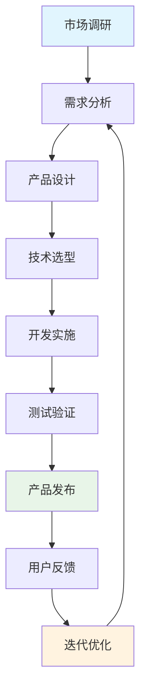
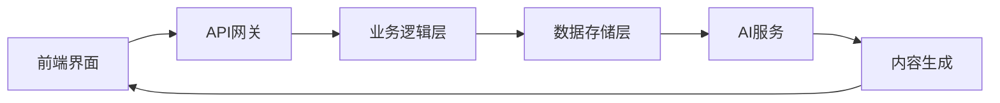
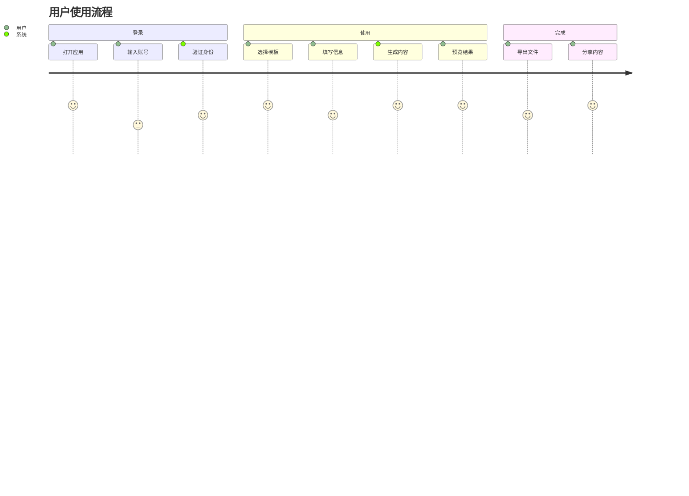

# AI产品策略与愿景测试文档

## 概述

本文档用于测试增强版模板生成器的功能，包括Mermaid流程图渲染、现代化样式系统等核心特性。

## 产品发展路线图

## 核心功能特性

### 1. 智能内容生成
- 基于AI的自动化内容创建
- 多语言支持（中文/英文）
- 智能语法检查和优化

### 2. 现代化界面设计
- 响应式布局设计
- CSS变量系统
- 渐变色彩方案

### 3. Mermaid图表支持
- 流程图自动渲染
- 语法错误自动修复
- 多种图表类型支持

## 技术架构

## 用户体验流程

## 总结

本测试文档验证了增强版生成器的以下功能：
- ✅ Markdown内容解析
- ✅ Mermaid流程图渲染
- ✅ 现代化HTML生成
- ✅ 多语言内容支持

通过这些测试，确保了生成器能够正确处理复杂的内容结构和图表渲染需求。 